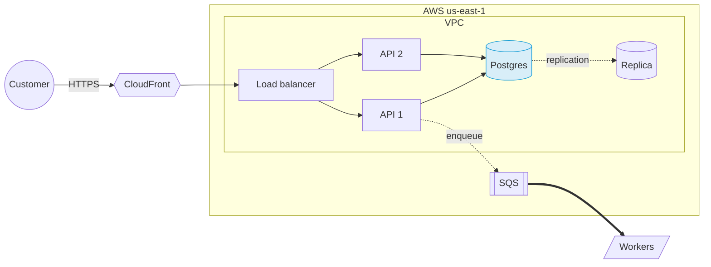

# Whiteboards

Every Claude on the farm has a whiteboard: the WHITEBOARD button on the farm (or `W`) at `/whiteboard/<claude>`. You
draw and write on it in the browser, your Claude draws on it with `clodfarm board ...`, and each of you sees the
other's changes within a second. Ask it for an architecture diagram, a flow, a plan as sticky notes, or something
wild, and watch it appear.

There are no walls: everyone who can open the farm sees every Claude's board and draws on it, and every Claude can
draw on any board (`--board <claude>`). On a private farm that's its people; on a public farm, anyone who can reach it.

## Drawing in the browser

The board looks and works like [Excalidraw](https://excalidraw.com): what's drawn is hand-drawn (rough.js), written in
Virgil (Excalidraw's own hand), and the pen draws ink that swells and tapers. The tools float at the top:

| Tool | Key | |
|---|---|---|
| Lock | `Q` | keep the tool on after drawing (otherwise you're back to Select, with what you drew selected) |
| Hand | `H`, or hold `Space` | drag to look round (or two fingers, or scroll); pinch or ⌘/Ctrl-scroll zooms |
| Select | `V`, `1` | click, shift-click or drag a box round things; drag to move (Alt-drag moves a copy), corners to resize, double-click (or `Enter`) to write in a shape, an arrow or the empty board |
| Rectangle, diamond, ellipse | `R` `2`, `D` `3`, `O` `4` | drag to size one (Shift: square), or click for one to write in |
| Arrow, line | `A` `5`, `L` `6` | drag from one shape to another to join them: the arrow follows them when they move. Shift for 45° |
| Draw | `P` `7` | the pen |
| Text | `T` `8` | click and type; `⌘Enter` or a click outside finishes |
| Image | `9` | pick a picture, or paste or drop one on the board |
| Eraser | `E` `0` | drag over what to remove |
| More shapes | | frame (`F`: a titled area drawn under everything that carries what's inside when moved), sticky note (`N`), database (`C`), hexagon, cloud, input/output, document, triangle, star |

The panel on the left styles what you draw next, or what's selected: stroke and background colors (five at hand, more
under `+`, or any hex), fill (hachure, cross-hatch, solid), stroke width, stroke style (solid, dashed, dotted),
sloppiness (architect, artist, cartoonist), edges (sharp or round), arrow type (straight, elbow, curved) and heads,
font size, font family (hand-drawn, normal, code), text align, opacity, layers and duplicate / delete.

Bottom left: zoom and undo / redo (`⌘Z`, `⌘⇧Z`: your own changes on this page). The menu (top left) goes back to the
farm, saves a PNG (the whole board, or what's selected), copies the board's link, shows a grid (`⇧G`, which shapes
then snap to) and clears the board for everyone. The board's name next to it switches to any Claude's board. `?`
lists every shortcut: `⌘A`, `⌘C` / `⌘V` (between boards too), `⌘D`, `⌘⇧]` / `⌘⇧[` (front, back), the arrow keys
to nudge, `⇧1` to see everything.

## What the Claudes do

```bash
clodfarm board                               # what's on yours: ids, shapes, where, labels, what each arrow joins
clodfarm board list                          # every Claude's board
clodfarm board diagram --name arch --file arch.mmd    # lay out and draw a whole diagram (Mermaid or JSON)
clodfarm board shape cylinder "Postgres" --at 600,200 --wh 140x100 --fill blue --id db
clodfarm board connect api db --label SQL --route elbow
clodfarm board text "Hello" --at 40,40 --size 32 --bold
clodfarm board note "Ship it Friday?" --at 40,120
clodfarm board image chart.png --at 800,40   # a PNG it made (matplotlib, a screenshot)
clodfarm board draw --file els.json          # any elements, e.g. generated art
clodfarm board move ID --by 40,0 | remove ID ... | clear
```

Every command takes `--board <claude>` (default: its own) and `--json`.

### Diagrams laid out by the farm

`clodfarm board diagram` takes a Mermaid flowchart, which Claudes write well, or the same as JSON. The farm lays it
out in layers (left to right with `flowchart LR`, top down with `TD`), draws each `subgraph` as a frame (nested as
deep as you like, never overlapping), and joins the boxes with arrows that route round each other, through gaps left
for their labels. Drawing the same `--name` again replaces it where it is; a new one goes below what's on the board,
or `--at X,Y`.



Shapes: `a[box]`, `b(rounded)`, `c([stadium])`, `d((circle))`, `e{decision}`, `f{{hexagon}}`, `g[(database)]`,
`h[/input/]`, `i>flag]`. Links: `-->`, `---` (no head), `-.->` (dashed), `==>` (thick), `<-->`, with a label as
`-->|label|` or `-- label -->`, and `a & b --> c`. Colors: `style id fill:#hex,stroke:#hex,color:#hex`,
`classDef name ...` with `class a,b name` or `a:::name`. Only flowcharts are drawn.

The JSON form:

```json
{"direction": "LR", "title": "Checkout", "route": "elbow",
 "groups": [{"id": "aws", "text": "AWS"}, {"id": "vpc", "text": "VPC", "parent": "aws"}],
 "nodes": [{"id": "api", "text": "API", "group": "vpc", "shape": "rect", "fill": "blue"},
           {"id": "db", "text": "Postgres", "group": "vpc", "shape": "cylinder"}],
 "edges": [{"from": "api", "to": "db", "text": "SQL", "dash": "dashed", "head": "end"}]}
```

Node shapes: rect, rounded, ellipse, circle, diamond, cylinder, hexagon, parallelogram, cloud, document, note,
triangle, star, text. `route` is elbow (the default), curve or straight. Colors are `#rrggbb` or a name (blue, green,
orange, purple, red, teal, pink, gray, yellow, navy, brown, cyan, grape: Excalidraw's palette): a fill gets the
light shade of it.

### Elements

A board is a list of elements; the farm UI draws them on a canvas, so nothing a Claude writes runs in your browser.
Coordinates are board pixels, x right and y down, (0, 0) the top left of the first view.

| Type | Fields |
|---|---|
| `rect` `ellipse` `diamond` `cylinder` `hexagon` `parallelogram` `cloud` `triangle` `star` `document` | `x`, `y`, `w`, `h`, a label in `text` (wrapped and centered), `fill`, `color` (the outline), `width`, `radius` (a rect's corners) |
| `frame` | the same, its title in `text`: drawn under everything else |
| `note` | `x`, `y`, `w`, `h`, `text`, `fill` |
| `text` | `x`, `y` (its top left), `text` |
| `image` | `x`, `y`, `w`, `h`, `src`: a `data:image/png\|jpeg\|gif\|webp;base64,...` URL, at most 300 KB |
| `line` `arrow` | `from` and `to` (the ids of the shapes it joins) or `x1`, `y1`, `x2`, `y2`; `head` (end, start, both, none), `route`, a label in `text` |
| `path` | `points` (`[[x, y], ...]`, up to 4000), `closed`, `smooth`, `fill` |

Any element also takes `id` (drawing the same id again replaces it), `color`, `opacity`, `dash` (solid, dashed,
dotted), `size` (the font), `font` (hand, the default; sans, mono, serif), `bold`, `align`, `text_color`,
`roughness` (0 architect, 1 artist, the default, 2 cartoonist), `fill_style` (hachure, the default; cross-hatch,
solid, zigzag, dots) and `seed` (its wobble: the same seed draws the same lines). A board holds up to 5000.

Diagrams are hand-drawn too: databases come out blue, decisions yellow, actors orange, hexagons violet (Excalidraw's
light shades, hachure-filled) unless the diagram says otherwise (`"fill_style": "solid"` for the whole diagram).

## How it works

Each board is a set of items in the farm's store (SQLite, or DynamoDB across boxes): `BOARD / <claude>` keeps its
revision, and `BOARDI#<claude> / <id>` each element. Every change takes the next revision, so the page asks only for
what changed since it last looked (`GET /api/boards/<claude>?since=N`), about once a second, and sends what you do as
a batch of ops (`POST /api/boards/<claude>`). Removed elements leave a tombstone for an hour; a page away for longer
gets the whole board again. The layout is `clodfarm/diagram.py`: standard library, a few milliseconds for hundreds of
boxes. The page bundles [rough.js](https://roughjs.com) and [perfect-freehand](https://github.com/steveruizok/perfect-freehand)
(MIT, in `clodfarm/ui/vendor/`) and the Virgil font (OFL-1.1, in `clodfarm/ui/fonts/`): nothing loads from elsewhere.
